<p align="center">
  
</p>

<h1 align="center">VerifyChain RWA</h1>

<p align="center">
  <strong>🏆 IIT Kharagpur Blockchain Summit 2.0 — East India's Largest Blockchain Hackathon</strong>
</p>

<p align="center">
  <a href="#features">Features</a> •
  <a href="#architecture">Architecture</a> •
  <a href="#tech-stack">Tech Stack</a> •
  <a href="#getting-started">Getting Started</a> •
  <a href="#smart-contracts">Smart Contracts</a> •
  <a href="#api-reference">API</a>
</p>

<p align="center">
  
  
  
  
</p>

---

## 🎯 Problem Statement

Government bonds are sovereign-backed, safe investment instruments—yet **retail participation remains critically low**. The missing piece isn't issuance; it's **trust infrastructure**.

| Challenge | Impact |
|-----------|--------|
| 🚫 High minimum thresholds | Excludes 90% of retail investors |
| 📄 Paper-heavy onboarding | 7-14 day settlement cycles |
| 🔒 Illiquid secondary markets | Capital locked until maturity |
| 👁️ Opaque yield visibility | No real-time payout tracking |
| ⚠️ No tamper-proof verification | Fake/duplicate token fraud risk |

---

## 💡 Solution: VerifyChain RWA

**VerifyChain** is a **trust engine** for Real World Assets—providing AI-powered verification, cryptographic proof-of-reserve, and on-chain compliance for tokenized government bonds.

### Core Capabilities

```
┌─────────────────────────────────────────────────────────────────┐
│                    VERIFYCHAIN TRUST ENGINE                     │
├─────────────────────────────────────────────────────────────────┤
│  📄 PDF Upload  →  🤖 AI Analysis  →  📊 Oracle Feed  →  ⛓️ Mint │
│                                                                 │
│  • Llama 3.3 extracts ISIN, Face Value, Maturity               │
│  • Yahoo Finance provides live 10Y Treasury yield               │
│  • Smart contract enforces Proof-of-Reserve limits              │
│  • Weilliptic blockchain ensures immutable audit trail          │
└─────────────────────────────────────────────────────────────────┘
```

---

## 🏗️ Architecture

### System Flow


### Verification Pipeline

```mermaid
sequenceDiagram
    participant User
    participant Frontend
    participant Backend
    participant Oracle
    participant Contract
    
    User->>Frontend: Upload Bond PDF
    Frontend->>Backend: POST /analyze_and_oracle
    Backend->>Backend: Extract text (PyPDF2)
    Backend->>Backend: AI Analysis (Llama 3.3)
    Backend->>Oracle: Fetch 10Y Yield
    Oracle-->>Backend: Live yield data
    Backend-->>Frontend: {ai_analysis, oracle_data}
    Frontend->>Contract: createAsset(name, isin, faceValue, yield)
    Contract->>Contract: Validate PoR limits
    Contract-->>Frontend: Asset ID + TX Hash
    Frontend-->>User: ✅ Bond Tokenized
```



### Smart Contract Architecture


---

## 🛠️ Tech Stack

| Layer | Technology | Purpose |
|-------|------------|--------|
| **Frontend** | Next.js 15, Tailwind CSS, Framer Motion | Responsive UI with glassmorphism design |
| **Blockchain** | Solidity 0.8.20, @weilliptic/weil-sdk | Smart contracts & wallet integration |
| **AI Agent** | Llama 3.3 70B (Groq) | Document analysis & data extraction |
| **Oracle** | Yahoo Finance API | Real-time treasury yield feeds |
| **Backend** | Flask, PyPDF2 | PDF processing & API gateway |
| **Network** | Weilliptic Chain | Next-gen secure blockchain |

---

## ✨ Features

### AI-Powered Document Verification
- **Llama 3.3 70B** analyzes bond certificates in real-time
- Extracts critical data: ISIN, Face Value, Maturity Date, Issuer
- 95%+ accuracy on government bond PDFs

### Real-Time Oracle Integration
- **Yahoo Finance API** provides live 10-year Treasury yields
- Ensures on-chain data reflects current market conditions
- Automated price feed updates

### Proof-of-Reserve Engine
- Smart contract enforces tokenization limits
- Face Value = Maximum mintable tokens
- Prevents over-collateralization fraud

### Institutional-Grade UI
- Glassmorphism design with void gradients
- Real-time trust score visualization
- Terminal-style logging for transparency

---

## 🚀 Getting Started

### Prerequisites

- Node.js 18+
- Python 3.9+
- Weil Wallet or compatible wallet
- Weilliptic testnet tokens

### Installation

```bash
# Clone the repository
git clone https://github.com/your-username/verifychain-rwa.git
cd verifychain-rwa

# Frontend setup
cd frontend
npm install
npm run dev

# Backend setup (new terminal)
cd backend
pip install -r requirements.txt
python app.py
```

### Environment Variables

```env
# Backend (.env)
GROQ_API_KEY=your_groq_api_key

# Frontend uses public RPC
NEXT_PUBLIC_CELO_RPC=https://alfajores-forno.celo-testnet.org
```

---

## 📜 Smart Contracts

### Deployed Contract

| Network | Address | Explorer |
|---------|---------|----------|
| Celo Sepolia | `0xE715acd4c54F030d021b7147c20786623fFf482a` | [View on CeloScan](https://alfajores.celoscan.io/address/0xE715acd4c54F030d021b7147c20786623fFf482a) |

### Key Functions

```solidity
// Create a verified asset on-chain
function createAsset(
    string memory _name,      // Bond name
    string memory _isin,      // ISIN identifier  
    uint256 _faceValue,       // Face value in INR
    uint256 _yield            // Yield in basis points (e.g., 725 = 7.25%)
) public returns (uint256)

// Retrieve asset details
function getAsset(uint256 _id) public view returns (Asset memory)

// Get total assets count
function getAssetCount() public view returns (uint256)
```

---

## 📡 API Reference

### POST `/analyze_and_oracle`

Analyzes a bond PDF and fetches live oracle data.

**Request:**
```bash
curl -X POST https://verifychain-rwa.onrender.com/analyze_and_oracle \
  -F "file=@bond_certificate.pdf"
```

**Response:**
```json
{
  "ai_analysis": {
    "name": "Government of India Bond 2030",
    "isin": "IN0020230012",
    "face_value_amount": "100000"
  },
  "oracle_data": {
    "live_yield": 7.25,
    "source": "Yahoo Finance",
    "timestamp": "2026-01-14T10:30:00Z"
  }
}
```

---

## 🌍 Why Celo?


**Key Benefits:**
- ⚡ **Sub-second finality** — Instant transaction confirmation
- 💰 **< $0.001 gas fees** — Accessible for micro-transactions
- 🌱 **Carbon-negative** — Aligned with ESG mandates
- 📱 **Mobile-first** — Phone number to wallet mapping

---

## 🗺️ Roadmap


---

## 📂 Project Structure

```
verifychain-rwa/
├── frontend/                 # Next.js 15 application
│   ├── src/
│   │   ├── app/
│   │   │   ├── page.tsx     # Landing page
│   │   │   └── home/        # Dashboard
│   │   └── components/      # Reusable UI components
│   └── package.json
├── backend/                  # Flask API server
│   ├── app.py               # Main application
│   └── requirements.txt     # Python dependencies
├── contracts/               # Solidity smart contracts
│   └── VerifyChainRWA.sol   # Main RWA contract
└── README.md
```

---

## 🔒 Security Considerations

- **No private keys stored** — Client-side wallet signing only
- **Input validation** — All PDF inputs sanitized
- **Rate limiting** — API protected against abuse
- **Audit trail** — All transactions logged on-chain

---

## 👥 Team

Built with ❤️ for **IIT Kharagpur Blockchain Summit 2.0** — East India's Largest Blockchain Hackathon

---

## 🤝 Contributing

We welcome contributions! Please see our [Contributing Guide](CONTRIBUTING.md) for details.

1. Fork the repository
2. Create your feature branch (`git checkout -b feature/amazing-feature`)
3. Commit your changes (`git commit -m 'Add amazing feature'`)
4. Push to the branch (`git push origin feature/amazing-feature`)
5. Open a Pull Request

---

## 📄 License

This project is licensed under the MIT License — see the [LICENSE](LICENSE) file for details.

---

<p align="center">
  <strong>⛓️ Bringing Trust to Tokenization</strong>
</p>

<p align="center">
  <a href="https://celo.org">
    
  </a>
  <a href="https://groq.com">
    
  </a>
</p>
